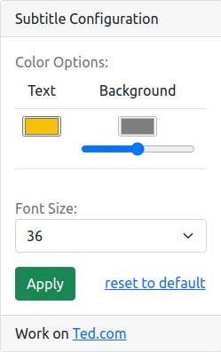
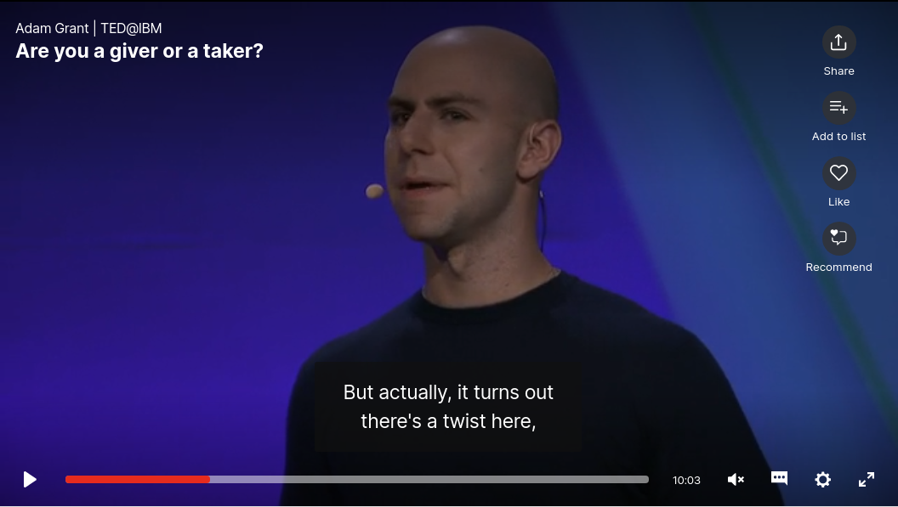
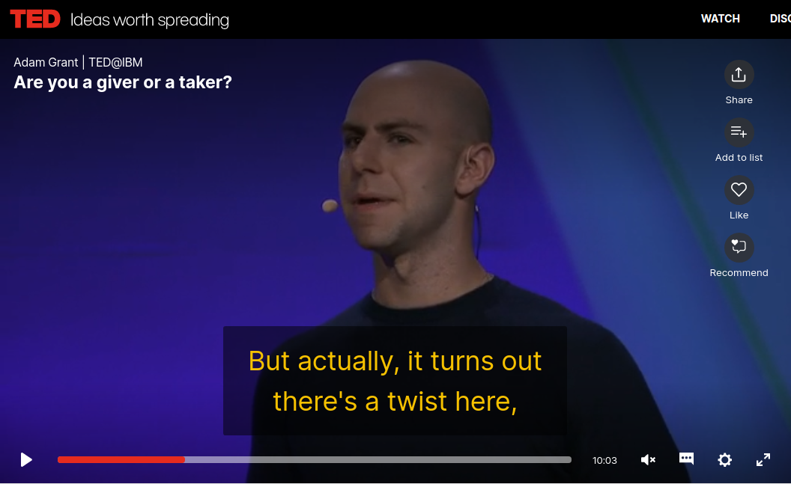

# TedSub
this is a Google chrome extension for modify color and size of subtitle on Ted.com

## Work On Ted.com
this extension created for ted.com, so check it on ted.com/talk/*

### Code information
The logic write with pure javascript and use bootstrap for ui

## Installation
Open chrome://extensions/ address on chrome  
Set enable Developer mode (right on top)  
Click on "Load Unpacked" Button  
Select Extension Directory  
 

#### Screenshots
##### Popup View

##### Before Apply

##### After Apply

